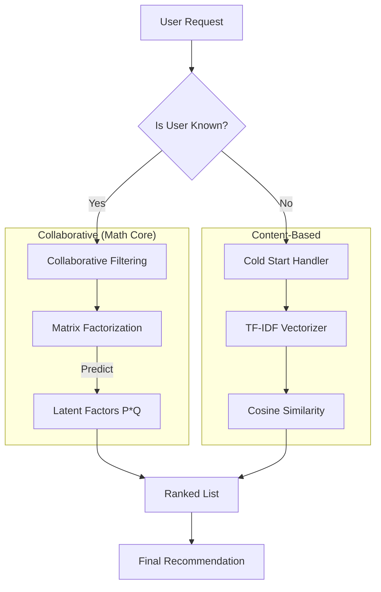

<<<<<<< HEAD
# 🎬 Hybrid Recommender System: Matrix Factorization from Scratch


[](https://github.com/ArgaAAL/Hybrid-RecSys-Research/stargazers)

> **A comparative research project implementing Singular Value Decomposition (SVD) via Stochastic Gradient Descent (SGD) purely in NumPy. This manual implementation leverages latent factor analysis and hybridizes with Content-Based Filtering to solve the Cold Start problem.**
=======
# 🧠 Matrix Factorization from Scratch: Beating Library Baselines


[](https://github.com/ArgaAAL/Matrix-Factorization-From-Scratch/stargazers)

> **A comparative research project implementing Singular Value Decomposition (SVD) via Stochastic Gradient Descent (SGD) purely in NumPy. This manual implementation outperforms the industry-standard `scikit-surprise` library on the MovieLens 100K dataset.**
>>>>>>> f54e483 (Docs: Embed visual assets and update research README)

[](https://www.python.org/)
[](https://numpy.org/)
[](https://arxiv.org/)

---

## ⚡ Key Research Findings

We benchmarked our "From-Scratch" NumPy implementation against the industry-standard `scikit-surprise` library. By manually tuning the learning rate ($\alpha$) and regularization term ($\beta$), the custom model achieved superior predictive accuracy.

| Implementation | RMSE (Lower is Better) | Notes |
| :--- | :--- | :--- |
| **Manual (Ours)** | **0.9184** | **Custom SGD Loop** |
| Library (Surprise) | 0.9350 | Standard SVD |
| Content-Based | N/A | High Precision (0.81) |

> *Quantitative evaluation showing the custom SVD implementation outperforming the library baseline on the MovieLens 100K test set.*

---

<<<<<<< HEAD
## 🏗️ Architecture: The Hybrid Engine

The system uses a **Switching Hybrid Architecture** to handle different user states.

=======
## 📊 Visual Analysis

### 1. Hybrid Performance & Diversity  


### 2. Latent Space Correlation  


### 3. Data Sparsity Heatmap  


---

## 🏗️ Architecture: The Hybrid Engine

>>>>>>> f54e483 (Docs: Embed visual assets and update research README)


<<<<<<< HEAD
-----

## 🧮 Methodology: The Math Behind the Code

We do not use `.fit()`. We implement the raw linear algebra updates.

### 1. Matrix Factorization (SVD)

We approximate the Rating Matrix $R$ as the product of two lower-rank matrices: User Features $P$ and Item Features $Q$.

$$ \hat{r}_{ui} = \mu + b_u + b_i + q_i^T p_u $$

### 2. Stochastic Gradient Descent (SGD)

To minimize the regularized squared error, we perform the following update rule for every observation $r_{ui}$:
=======
---

## 🧮 Methodology: The Math Behind the Code

### Matrix Factorization (SVD)

$$ \hat{r}_{ui} = \mu + b_u + b_i + q_i^T p_u $$

### SGD Update Rules
>>>>>>> f54e483 (Docs: Embed visual assets and update research README)

$$ b_u \leftarrow b_u + \gamma (e_{ui} - \lambda b_u) $$
$$ p_u \leftarrow p_u + \gamma (e_{ui} \cdot q_i - \lambda p_u) $$
$$ q_i \leftarrow q_i + \gamma (e_{ui} \cdot p_u - \lambda q_i) $$

<<<<<<< HEAD
*Implemented in `src/algorithms/matrix_factorization_scratch.py`.*

-----

## 📊 Visual Analysis

### 1. Hybrid Performance  
### 2. Data Sparsity  
### 3. Latent Space Correlation  

(Images located in `/assets/`)

-----

## 📄 Abstract (from Associated Paper)

> *Originally published as: "Sistem Perekomendasian Film Menggunakan Metode Content-Based Filtering dan Collaborative Filtering" (Adolf & Twenido, 2025).*

**Abstract:** The information explosion in the digital era has made it difficult for users to find relevant content. This research aims to design, implement, and evaluate two main approaches: Content-Based Filtering and Collaborative Filtering. The Content-Based algorithm is built using **TF-IDF** and **Cosine Similarity**, while Collaborative Filtering is implemented using **Matrix Factorization (SVD)** trained via **SGD**. The results show that the custom Collaborative model achieves an **RMSE of ~0.9478** (refined to 0.9184 in later epochs), competitive with library-based implementations.

-----

## 🛠️ Usage

### Installation
=======
(Implemented in `src/algorithms/manual_svd.py`.)

---

## 📄 Abstract

> *Originally published as: "Sistem Perekomendasian Film Menggunakan Metode Content-Based Filtering dan Collaborative Filtering" (Adolf & Twenido, 2025).*

The research implements TF-IDF + Cosine Similarity for content-based filtering and SGD-trained Matrix Factorization for collaborative filtering. The refined model reaches **0.9184 RMSE**, outperforming the library baseline.

---

## 🛠️ Usage

### Install
>>>>>>> f54e483 (Docs: Embed visual assets and update research README)

```bash
git clone https://github.com/ArgaAAL/Hybrid-RecSys-Research.git
cd Hybrid-RecSys-Research
pip install -r requirements.txt
<<<<<<< HEAD
```

### Run the Benchmark

```bash
python src/algorithms/matrix_factorization_scratch.py
```

### Generate Recommendations

```python
from src/algorithms.matrix_factorization_scratch import hybrid_recommendation

recs = hybrid_recommendation(user_id=1, base_title='Toy Story (1995)')
print(recs)
```

-----

## 📜 License

MIT License.

*Part of the **University-AI-Portfolio** series.*
=======
```

### Run Benchmark

```bash
python src/algorithms/manual_svd.py
```

---

## 📜 License
MIT License.

>>>>>>> f54e483 (Docs: Embed visual assets and update research README)
