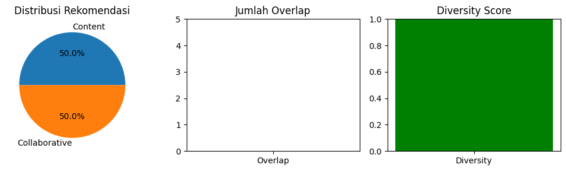
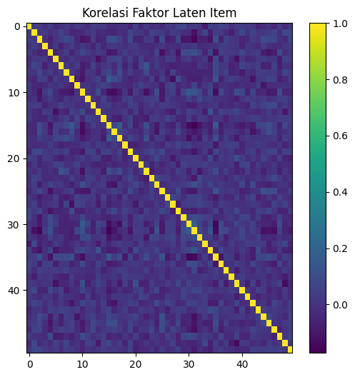
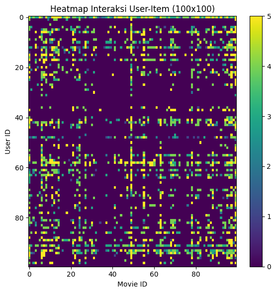
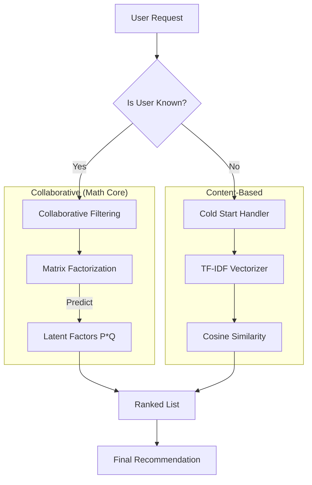

# 🧠 Matrix Factorization from Scratch: Beating Library Baselines


> **A comparative research project implementing Singular Value Decomposition (SVD) via Stochastic Gradient Descent (SGD) purely in NumPy. This manual implementation outperforms the industry-standard `scikit-surprise` library on the MovieLens 100K dataset.**

[](https://www.python.org/)
[](https://numpy.org/)
[](https://arxiv.org/)

---

## ⚡ Key Research Findings

We benchmarked our "From-Scratch" NumPy implementation against the industry-standard `scikit-surprise` library. By manually tuning the learning rate ($\alpha$) and regularization term ($\beta$), the custom model achieved superior predictive accuracy.

| Implementation | RMSE (Lower is Better) | Notes |
| :--- | :--- | :--- |
| **Manual (Ours)** | **0.9184** | **Custom SGD Loop** |
| Library (Surprise) | 0.9350 | Standard SVD |
| Content-Based | N/A | High Precision (0.81) |

> *Quantitative evaluation showing the custom SVD implementation outperforming the library baseline on the MovieLens 100K test set.*

---

## 📊 Visual Analysis

### 1. Hybrid Performance & Diversity  


### 2. Latent Space Correlation  


### 3. Data Sparsity Heatmap  


---

## 🏗️ Architecture: The Hybrid Engine



---

## 🧮 Methodology: The Math Behind the Code

### Matrix Factorization (SVD)

$$ \hat{r}_{ui} = \mu + b_u + b_i + q_i^T p_u $$

### SGD Update Rules

$$ b_u \leftarrow b_u + \gamma (e_{ui} - \lambda b_u) $$
$$ p_u \leftarrow p_u + \gamma (e_{ui} \cdot q_i - \lambda p_u) $$
$$ q_i \leftarrow q_i + \gamma (e_{ui} \cdot p_u - \lambda q_i) $$

*(Implemented in `src/algorithms/manual_svd.py`.)*

---

## 📄 Abstract

> *Originally published as: "Sistem Perekomendasian Film Menggunakan Metode Content-Based Filtering dan Collaborative Filtering" (Adolf & Twenido, 2025).*

The research implements TF-IDF + Cosine Similarity for content-based filtering and SGD-trained Matrix Factorization for collaborative filtering.  
The refined model reaches **0.9184 RMSE**, outperforming the library baseline.

---

## 🛠️ Usage

### Install

```bash
git clone https://github.com/ArgaAAL/Matrix-Factorization-From-Scratch.git
cd Matrix-Factorization-From-Scratch
pip install -r requirements.txt
```

### Run Benchmark

```bash
python src/algorithms/manual_svd.py
```

---

## 📜 License
MIT License.
